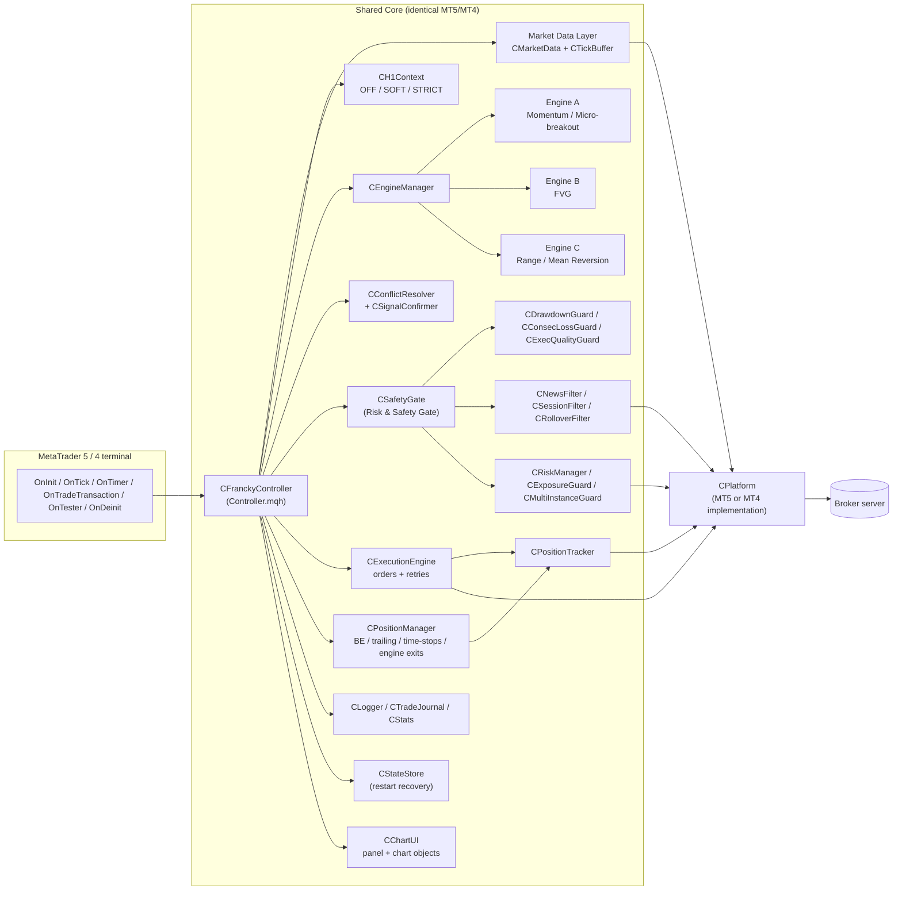
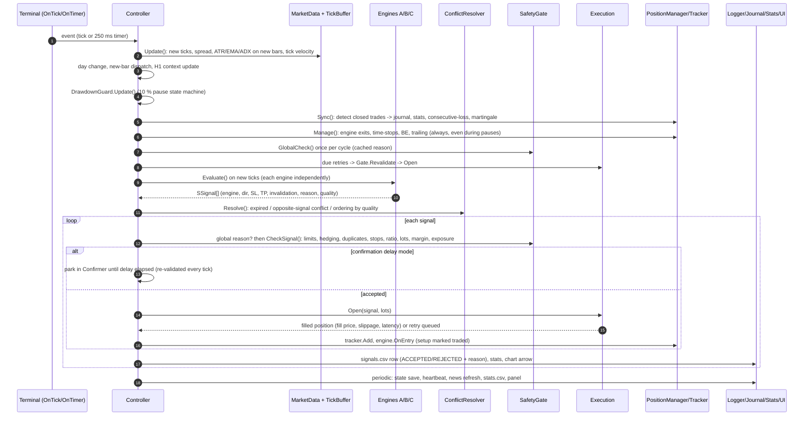
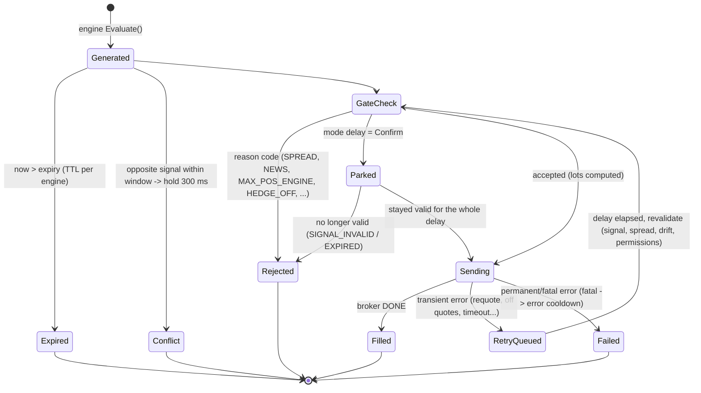
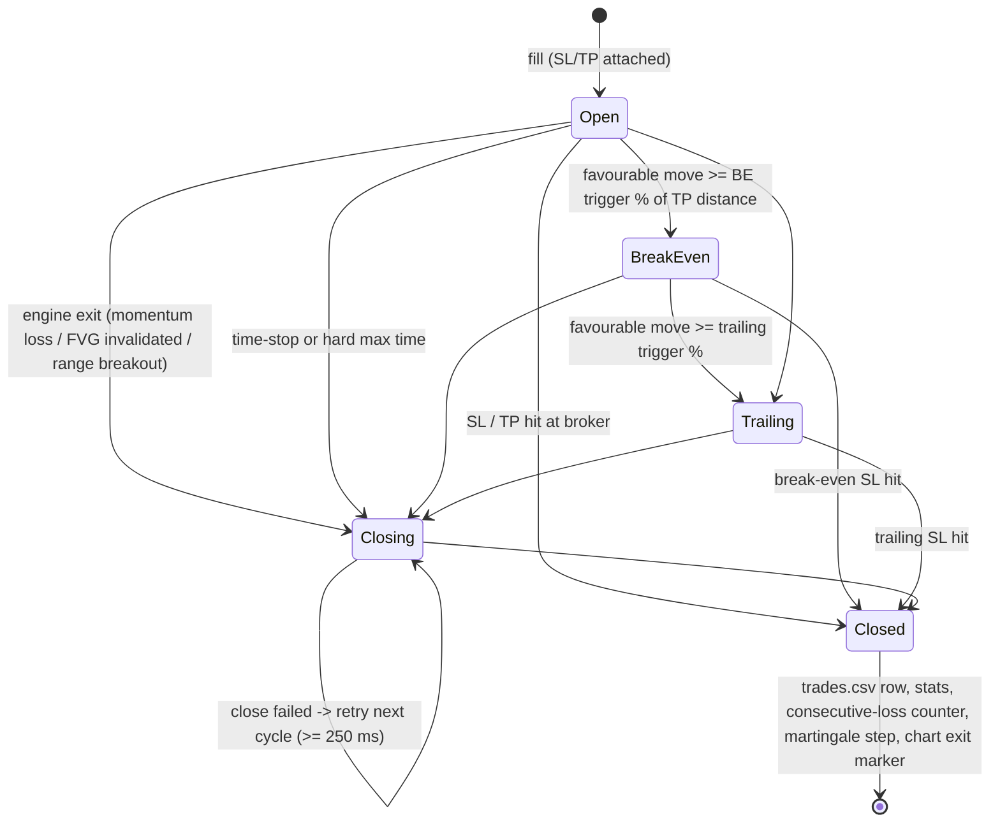
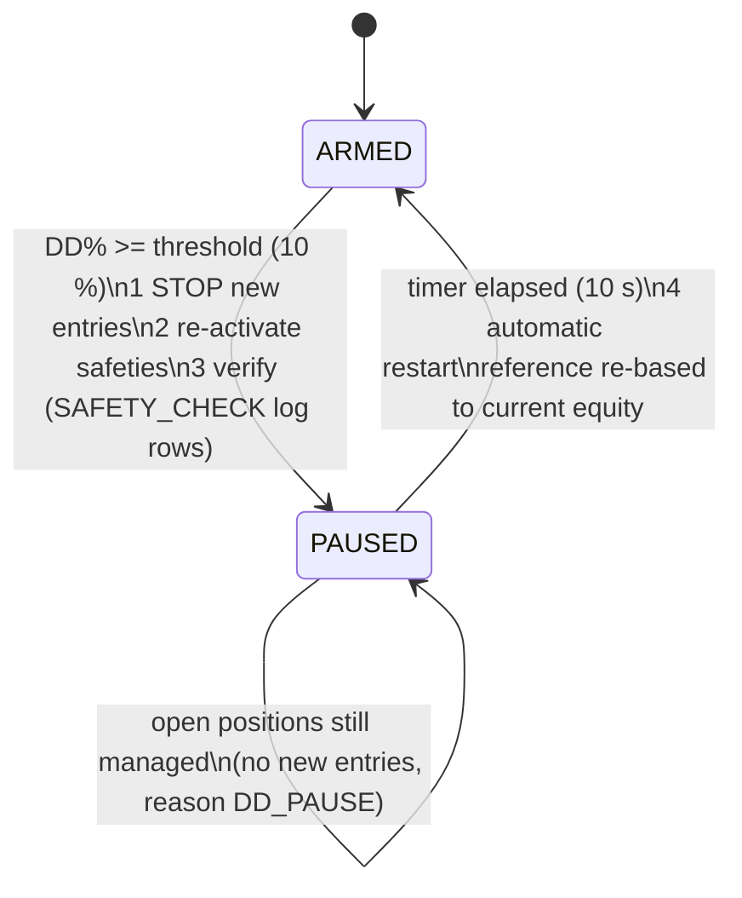
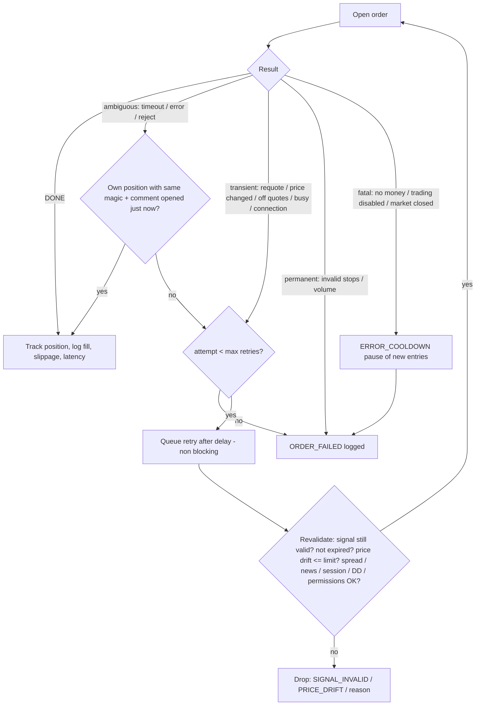
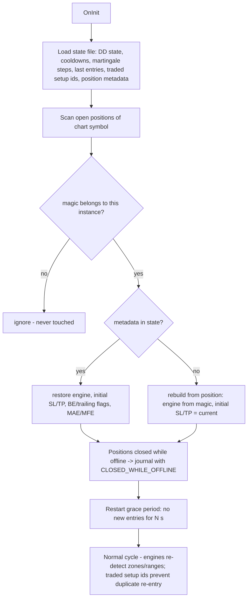

# 02 - Architecture and Workflow

> How FRANCKY TRI-FLUX is built and how data moves from the market to the order. Diagrams use Mermaid
> (rendered by GitHub, VS Code, Obsidian...). Binding signatures are in `docs/09_SSOT_Developer_Contract.md`;
> exact trading rules in `docs/03_Strategy_Logic.md`.

## 1. Big picture

* **One EA, two platforms.** `FranckyTriFlux.mq5` (MT5, reference) and `FranckyTriFlux.mq4` (MT4 port) are
  20-line files that forward terminal events to `CFranckyController`. Everything else is in
  `Include\FranckyTriFlux\`.
* **Shared Core + Platform layer.** All logic (engines, risk, protections, logging, chart UI) is in `Core\` and
  is byte-identical in both trees. Only `Platform\Platform.mqh` (class `CPlatform`) differs: CTrade /
  CopyTicks / indicator handles / economic calendar on MT5, OrderSend / iATR / MarketInfo on MT4.
* **One instance = one chart symbol.** The symbol is captured at start; every order uses it. Several symbols
  = several charts (instances), each with its own Instance ID and magic numbers.
* **Three independent engines.** Momentum / Micro-breakout, FVG, Range / Mean Reversion run in parallel on
  every tick; each can trade alone (max 3 positions each, 9 per symbol).

## 2. Module responsibilities (spec Table 5 mapping)

| Spec module (Table 5) | Class(es) | File |
|---|---|---|
| Market Data Layer | `CMarketData`, `CTickBuffer`, `CClock` | MarketData.mqh, TickBuffer.mqh, Clock.mqh |
| H1 context (Addendum A) | `CH1Context` | H1Context.mqh |
| Strategy Engine Manager | `CEngineManager` | EngineManager.mqh |
| Engines A/B/C | `CEngineMomentum`, `CEngineFVG` (+ `CStructure` for BOS/CHoCH/liquidity), `CEngineRange` | Engine*.mqh, Structure.mqh |
| Signal Bus | `SSignal` struct + signal array of the cycle | Types.mqh |
| Conflict Resolver | `CConflictResolver`, `CSignalConfirmer` | ConflictResolver.mqh |
| Risk & Safety Gate | `CSafetyGate` + protections, filters, risk | SafetyGate.mqh, Protections.mqh, Filters.mqh, RiskManager.mqh |
| Execution Engine | `CExecutionEngine` (+ `CPlatform` order calls) | Execution.mqh, Platform.mqh |
| Position Manager | `CPositionManager`, `CPositionTracker` | PositionManager.mqh, PositionTracker.mqh |
| Journal & Analytics | `CLogger`, `CTradeJournal`, `CStats` | Logger.mqh, Journal.mqh, Stats.mqh |
| Restart recovery (B.7) | `CStateStore`, `CPositionTracker::RecoverOnStart` | StateStore.mqh |
| Visual layer | `CChartUI` | ChartUI.mqh |
| Tester / Optimizer | `OnTester` -> `CStats::OptCriterion`, generated .set/.ini | Stats.mqh, tools/generate.py |

## 3. Data flow - market to order (one cycle)

### 3.1 Why bar data is refreshed only on new bars
Engines react tick-by-tick, but indicator values (ATR, EMA, ADX, ROC) are read from the **last closed bar**
and cached once per bar. This keeps the per-tick work tiny (HFT-style reactivity), makes backtests
reproducible and avoids repainting.

## 4. Signal life cycle

Every terminal state writes one row in `signals.csv` with its reason.

## 5. Position life cycle

## 6. Equity drawdown pause (spec G.4 as agreed)

The pause is a strict timer; the verification never extends it.

## 7. Order retry flow (spec B.8)

## 8. Restart / reconnection recovery (spec B.7)

## 9. Identification of orders

| Item | Rule |
|---|---|
| Magic number | `Magic number base + Instance ID x 10 + engine` (1 Momentum, 2 FVG, 3 Range). Default base MT5 5 100 000, MT4 4 100 000. |
| Order comment | `FTF|MOM|I1|<setup>` (max 31 chars; brokers may alter comments - the magic is authoritative). |
| StrategyID | Derived from the magic number, stored in every journal row. |
| Instance ownership | An instance only manages positions with its own 3 magics on its chart symbol. |
| Duplicate instance | A second chart with the same Instance ID/symbol/account is detected through terminal global variables and refuses new entries (MULTI_INSTANCE). |

## 10. Timing model

| Activity | Frequency |
|---|---|
| Tick ingestion, engines, gate, execution, position management | every tick |
| Indicator cache (ATR, EMA, ADX, ROC, ATR median) | new M1/M5/H1 bar |
| FVG detection / Range detection | new bar of their timeframe |
| H1 context | new H1 bar |
| Timer cycle (pause expiry, retries, UI when no ticks) | 250 ms (live and MT5 tester; MT4 tester has no timer) |
| Dashboard refresh | 250 ms |
| State save / multi-instance heartbeat | every 2 s when changed |
| News list refresh | 60 min |
| stats.csv | 60 min + at stop |

## 11. Files written at run time

| File | Content |
|---|---|
| `ftf.log` | Human-readable log (INFO/DEBUG/TRACE) of every decision |
| `signals.csv` | One row per setup decision (accepted/rejected + reason) |
| `trades.csv` | One row per closed trade with all 20 mandatory fields of spec section 12 |
| `events.csv` | Protections, pauses, safety checks, order errors, retries, recovery |
| `stats.csv` | Per-engine + total statistics (Table 17 / section 11 metrics) |
| `state\*.state` | Restart recovery state (live/demo only) |

See `docs/06_Logs_and_Diagnostics.md` for the columns and how to analyse them.
